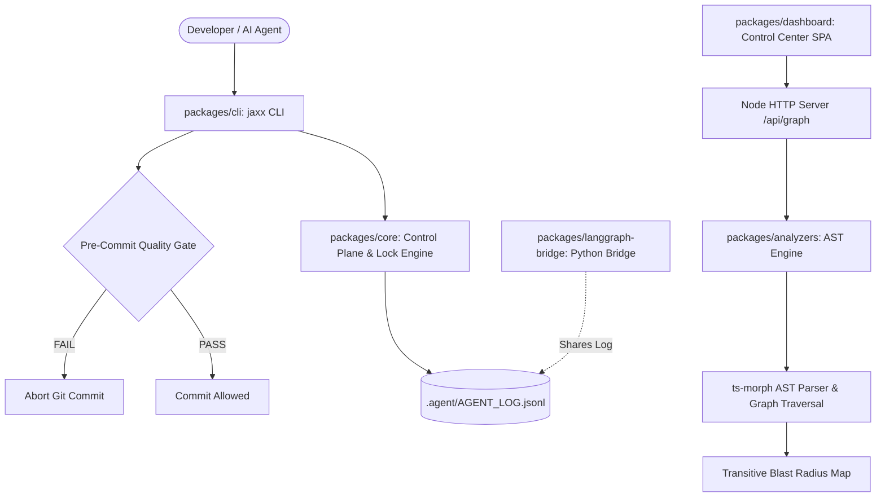

# Agent Jaxx Model

[](https://www.typescriptlang.org/)
[](./LICENSE)
[](./packages/analyzers)
[](./vitest.config.ts)
[](https://nodejs.org/)

Agent Jaxx Model is an open-source, whitelabel agent-engineering framework for software repositories. It provides a structured control plane in `.agent/` with persistent project memory, an append-only audit log, AST-driven quality gates, dependency blast-radius analysis, a skills registry, and a local real-time dashboard.

---

## Overview

Autonomous coding agents often fail at scale because execution state and project context live only inside temporary chat windows. When a session ends or context limits are reached, historical context is lost.

Agent Jaxx Model moves governance, verification, and state into the repository itself:

* **Persistent Project Memory:** All roadmaps, decisions, and progress live in versioned markdown files inside `.agent/`.
* **AST Quality Gates:** Analyzes TypeScript abstract syntax trees via `ts-morph` to enforce function complexity thresholds (cyclomatic complexity <= 10) and duplication limits (<= 5%).
* **Pre-Commit Enforcement:** Installs a git pre-commit hook that runs quality checks before any commit is accepted.
* **Dependency & Blast Radius Graph:** Computes transitive downstream impact for every file to identify affected modules before making changes.
* **Append-Only Audit Log:** Thread-safe, advisory-locked event log (`AGENT_LOG.jsonl`) for tracking multi-agent actions without race conditions.
* **Whitelabel Dashboard:** Lightweight React 18 + Tailwind 3 control center served locally on a native Node HTTP server.

---

## Repository Packages

| Package | Description |
| :--- | :--- |
| [`@jaxx/core`](./packages/core) | Core schemas, configuration loader, session management, append-only log, and advisory file locking. |
| [`@jaxx/cli`](./packages/cli) | CLI commands: `jaxx init`, `log`, `doctor`, `verify`, `session`, `skill`, `serve`. |
| [`@jaxx/analyzers`](./packages/analyzers) | AST analyzers (`ts-morph`) for cyclomatic complexity, code duplication, dead-code detection, and dependency graphs. |
| [`@jaxx/dashboard`](./packages/dashboard) | Control center interface with interactive SVG/Canvas dependency graph and blast-radius inspector. |
| [`@jaxx/langgraph-bridge`](./packages/langgraph-bridge) | Optional Python 3.11+ FastAPI / LangGraph multi-agent bridge sharing the unified audit log. |

---

## Architecture



---

## Quick Start

### 1. Try the Live Demo Locally (60 Seconds)
Clone, build, and launch the control center on this repository:

```bash
git clone https://github.com/EfraimRochaJaxx/.agent-jaxx-model.git
cd .agent-jaxx-model
npm install
npm run build
npm run dashboard:start
```
Open **`http://localhost:3099`** in your browser to inspect the live Architecture Dependency Graph, blast radius inspector, and real-time audit logs.

---

### 2. Use the CLI Globally (Optional)
To make the `jaxx` CLI available everywhere in your terminal:

```bash
# From the cloned repository root:
npm link packages/cli

# Now you can use `jaxx` anywhere:
jaxx --help
```

---

### 3. Add the Control Plane to Another Project
To govern any other codebase with Agent Jaxx Model:

```bash
cd /path/to/your-project

# Initialize .agent/ control plane, frame.config.ts, and git pre-commit hook:
jaxx init "Your Project Name"

# Record agent actions into the append-only log:
jaxx log INFO "Implemented authentication flow" --agent coder-1

# Run the AST quality gate & environment checks:
jaxx verify

# Launch the visual dashboard for your project:
jaxx serve
```
*(Note: If you didn't run `npm link`, you can run any command directly with `node /path/to/.agent-jaxx-model/packages/cli/dist/index.js <command>`)*.

---

## The `.agent/` Directory Structure

```
.agent/
├── STATE.md          Current project state and next steps (read first by agents)
├── PLAN.md           Roadmap and milestone checklist
├── PROGRESS.md       Log of completed milestones
├── DECISIONS.md      Architecture Decision Records (ADRs)
├── VERIFICATION.md   Automated verification summaries recorded on session close
├── BRANCHING.md      Git branch conventions (feat/<slug>)
├── COLLABORATION.md  Coordination rules for human and AI contributors
├── AGENT_LOG.jsonl   Append-only event stream
├── skills/           Skill registry (Markdown with YAML frontmatter)
└── frame.config.ts   Whitelabel configuration file (theme, thresholds, repos)
```

---

## Dogfooding

Agent Jaxx Model was built and verified using its own framework. All implementation phases, testing runs, and quality audits are recorded in the repository's own [`.agent/AGENT_LOG.jsonl`](./.agent/AGENT_LOG.jsonl) and [`.agent/VERIFICATION.md`](./.agent/VERIFICATION.md).

---

## Test Suites

```bash
npm test                                         # 56 Vitest tests across 10 suites
node packages/cli/dist/index.js doctor --quality # AST Quality Gate check
node scripts/clean-room.mjs                       # Clean-room isolated E2E suite (26 checks)
cd packages/langgraph-bridge && python -m pytest # 6 Python bridge tests
```

---

## Author & Community

Created by **Efraim Rocha** ([Jaxx Systems](https://github.com/Jaxx-Systems)):

* **LinkedIn:** [linkedin.com/in/efraimrocha7](https://www.linkedin.com/in/efraimrocha7/)
* **GitHub:** [@EfraimRochaJaxx](https://github.com/EfraimRochaJaxx)
* **Contributing:** See [`CONTRIBUTING.md`](./CONTRIBUTING.md) and [`docs/security.md`](./docs/security.md).

---

## License

This project is licensed under the [MIT License](./LICENSE).

