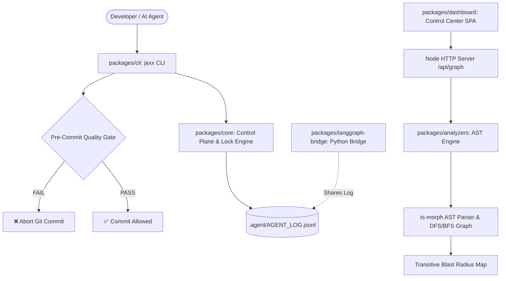

# ⚡ Agent Jaxx Model

<div align="center">

[](https://github.com/EfraimRochaJaxx/agent-jaxx-model/actions/workflows/ci.yml)
[](https://www.typescriptlang.org/)
[](./LICENSE)
[](./packages/analyzers)
[](./vitest.config.ts)
[](https://nodejs.org/)

**The deterministic, whitelabel control plane that puts autonomous coding agents inside software engineering cages.**

[Quick Start](#-quick-start-in-30-seconds) •
[Why Agents Fail](#-the-problem-prompts-are-not-guardrails) •
[Architecture & Blast Radius](#-interactive-architecture--blast-radius-graph) •
[Control Plane](#-the-agent-control-plane) •
[Dashboard](#-real-time-control-center-dashboard) •
[Author](#-author--community)

</div>

---

> ### 💡 The Core Thesis
> **Prompts are not guardrails.** Autonomous coding agents fail in production because LLM tool-calling is non-deterministic. If your safety model depends on asking the AI *"please remember to write clean code and test"*, your codebase will degrade into spaghetti.
>
> **Agent Jaxx Model** moves project memory, governance, and safety out of fragile conversation context and into the repository: **AST parsers (`ts-morph`), physical Git hooks, concurrency locks, and transitive blast-radius dependency graphs.**

---

## 💥 The Problem: Prompts vs. Deterministic Guardrails

| Toy AI Agent Wrappers | ⚡ Agent Jaxx Model |
| :--- | :--- |
| **State in chat window:** Context is wiped on notebook restart or token limits. | **State in repository:** Persistent project memory stored in versioned `.agent/` control plane. |
| **Prompt-based hopes:** Asks the LLM to follow coding guidelines. | **AST Compilers:** `ts-morph` enforces Cyclomatic Complexity $\le 10$ and Duplication $\le 5\%$. |
| **Silent blind commits:** The AI commits code that breaks hidden downstream files. | **Blast Radius Engine:** Computes transitive dependency impact map before touching code. |
| **Broken unverified code:** Relies on AI saying "everything works!". | **Physical Git Hooks (`pre-commit`):** The OS/Git binary physically blocks commits that fail quality gates. |
| **Race conditions:** Multiple agents overwrite files simultaneously. | **Advisory File Locking:** OS-level locks (`proper-lockfile` & `msvcrt/fcntl`) prevent lost updates. |
| **Hardcoded vendor lock-in:** Bound to specific proprietary clouds. | **100% Whitelabel & Open-Source:** Zero hardcoded assumptions; configured in `frame.config.ts`. |

---

## 🏛️ Architecture & Monorepo Packages



| Package | Purpose |
| :--- | :--- |
| [`@jaxx/core`](./packages/core) | Zod schemas, whitelabel config loader, session lifecycle, append-only log, advisory file locking, and safe Git execution. |
| [`@jaxx/cli`](./packages/cli) | Unified command surface: `jaxx init`, `log`, `doctor`, `verify`, `session`, `skill`, `serve`. |
| [`@jaxx/analyzers`](./packages/analyzers) | AST engine (`ts-morph`): cyclomatic complexity, code duplication, dead-code detection, and transitive dependency blast radius. |
| [`@jaxx/dashboard`](./packages/dashboard) | Whitelabel React 18 + Tailwind 3 SPA on a native Node HTTP server with interactive SVG/Canvas Architecture Graph. |
| [`@jaxx/langgraph-bridge`](./packages/langgraph-bridge) | Optional Python 3.11+ FastAPI / LangGraph orchestrator (orchestrator $\rightarrow$ coder $\rightarrow$ reviewer $\rightarrow$ QA) sharing the same audit log. |

---

## 🕸️ Interactive Architecture & Blast Radius Graph

Agent Jaxx Model features an AST-driven dependency engine that parses real TypeScript syntax trees across the entire monorepo:

* 🎯 **Transitive Downstream Blast Radius:** Click any file (e.g. `schemas.ts`) to see every direct and indirect file that will be affected if you modify it.
* 🔄 **Circular Dependency Detection:** DFS cycle-finding algorithm detects and highlights circular import chains.
* 🏝️ **Orphan File Detection:** Flags unused, dead, or orphaned modules with zero incoming/outgoing links.
* 🔍 **Live Search & Filter:** Instant filtering by High Blast Radius, Circular Cycles, or directory packages.

---

## 🚀 Quick Start in 30 Seconds

### 1. Install & Build
Requires Node.js 20+.
```bash
git clone https://github.com/EfraimRochaJaxx/agent-jaxx-model.git
cd agent-jaxx-model
npm install
npm run build
```

### 2. Initialize in Any Project
Drop the control plane into your repository:
```bash
npx @jaxx/cli init "My Project Name"
```
*(This creates `.agent/`, generates `frame.config.ts`, and automatically installs `.git/hooks/pre-commit`)*.

### 3. Verify Health & Quality Gate
```bash
node packages/cli/dist/index.js verify
```

### 4. Launch the Visual Control Center
```bash
npm run dashboard:start
# Open http://localhost:3099
```

---

## 📂 The `.agent/` Control Plane

When initialized, your project gets a persistent memory bank that AI agents read and respect:

```
.agent/
├── STATE.md          Current project state & blockers (agents read this first)
├── PLAN.md           High-level roadmap & milestone checklist
├── PROGRESS.md       Historical log of completed milestones
├── DECISIONS.md      Lightweight Architecture Decision Records (ADRs)
├── VERIFICATION.md   Auto-appended audit log summaries on session close
├── BRANCHING.md      Git branch & PR conventions (feat/<slug>)
├── COLLABORATION.md  Human-in-the-loop coordination protocol
├── AGENT_LOG.jsonl   Append-only, concurrent-safe event stream
├── skills/           Versionable skill registry (Markdown + YAML frontmatter)
└── frame.config.ts   THE whitelabel configuration surface (themes, thresholds, repos)
```

---

## 🐕 Dogfooding: Built by Itself

> **Agent Jaxx Model is its own first consumer.**
>
> Every feature in this repository—from the AST analyzers to the dashboard UI and Python bridge—was planned, executed, logged, and verified using the very same `.agent/` control plane. You can inspect the real audit trail in [`.agent/AGENT_LOG.jsonl`](./.agent/AGENT_LOG.jsonl) and [`.agent/VERIFICATION.md`](./.agent/VERIFICATION.md).

---

## 🧪 Comprehensive Verification Suite

```bash
npm test                      # 56 Vitest unit & integration tests across 10 suites (100% green)
node packages/cli/dist/index.js doctor --quality # AST Quality Gate (Complexity <= 10, Duplication <= 5%)
node scripts/clean-room.mjs    # Clean-room isolated E2E acceptance test (26 checks)
cd packages/langgraph-bridge && python -m pytest # 6 Python LangGraph bridge tests
```

---

## 👨‍💻 Author & Community

Created with ⚡ by **Efraim Rocha** ([Jaxx Systems](https://github.com/Jaxx-Systems)):

* **LinkedIn:** [linkedin.com/in/efraimrocha7](https://www.linkedin.com/in/efraimrocha7/)
* **GitHub:** [@EfraimRochaJaxx](https://github.com/EfraimRochaJaxx)
* **Contributions:** PRs and issues are welcome! Check out [`CONTRIBUTING.md`](./CONTRIBUTING.md) and [`docs/security.md`](./docs/security.md).

---

## 📄 License

This project is licensed under the [MIT License](./LICENSE). Drop it into personal, commercial, or enterprise projects with zero restrictions.

